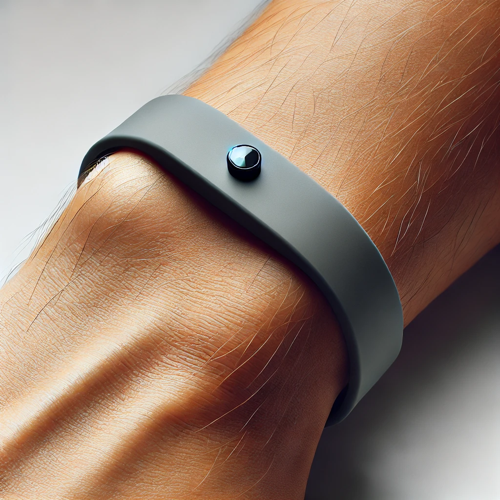

# Seizure Detection Wristband

## Repository Link

https://github.com/Timson1235/TinyMLSeizureDetectionDevice

## Description

In this project we used Edge Impulse to build a model that detects tonic clonic seizures with a wrist worn Tiny ML device.

### Task Type

Movement Classification

### Results Summary

- **Best Model:** Neural Network
- **Evaluation Metric:** Accuracy, F1-Score
- **Result:** 99.76%, F1-Score: 0.96

## Documentation

1. **[Literature Review](0_LiteratureReview/README.md)**
2. **[Dataset Characteristics](1_DatasetCharacteristics/exploratory_data_analysis.ipynb)**
3. **[Baseline Model](2_BaselineModel/baseline_model.ipynb)**
4. **[Model Definition and Evaluation](3_Model/model_definition_evaluation)**
5. **[Presentation](4_Presentation/README.md)**

## Cover Image

